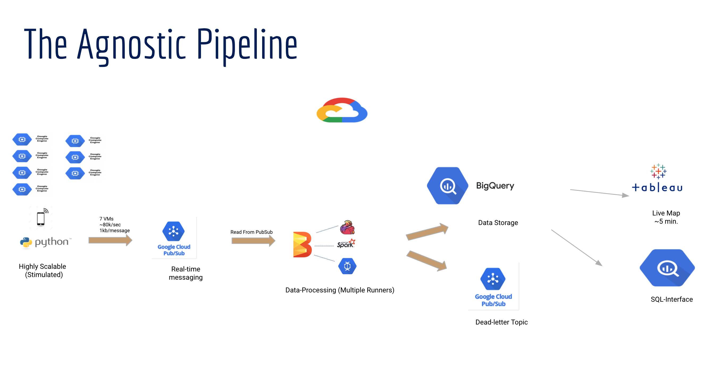
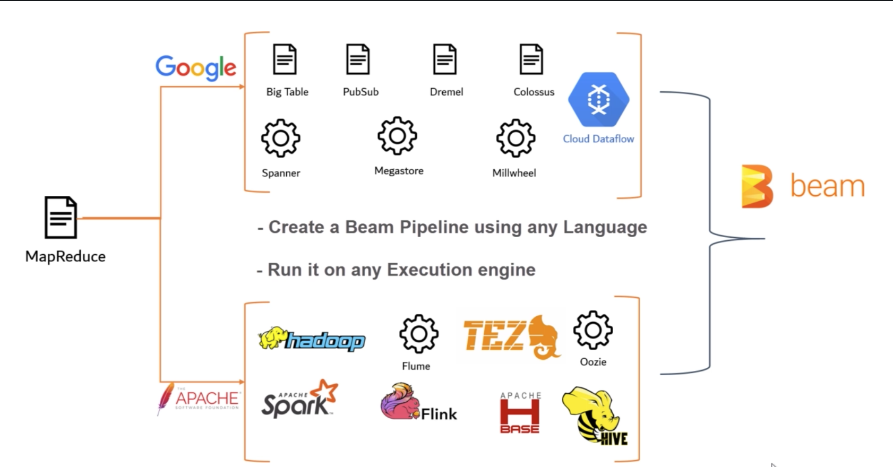
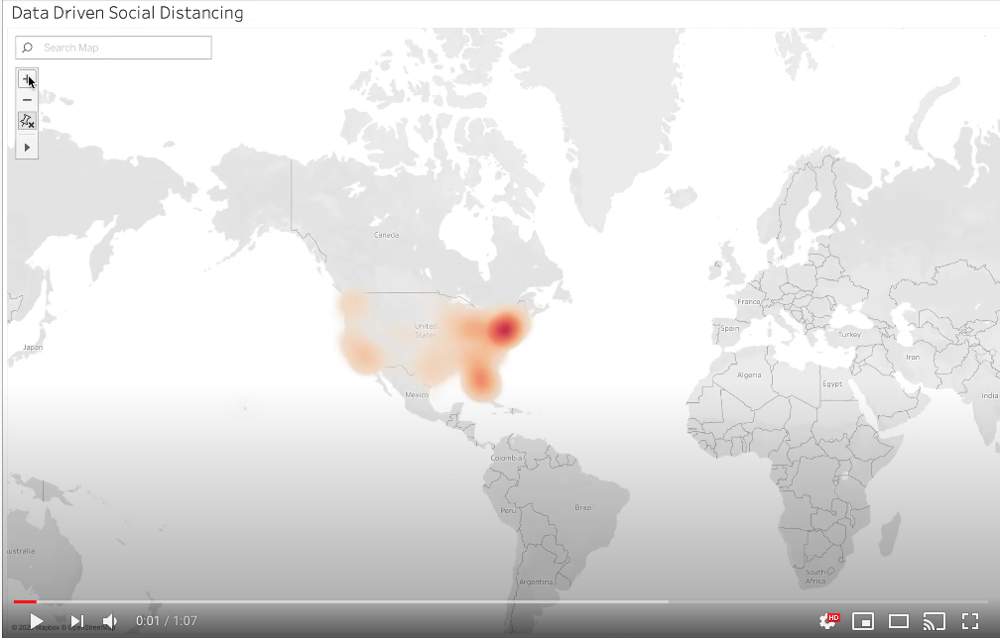

[](https://www.python.org/)

[](https://GitHub.com/Naereen/StrapDown.js/graphs/commit-activity) [](https://pypi.python.org/pypi/ansicolortags/) [](https://pypi.python.org/pypi/ansicolortags/)


# Background

With sensors devices being affordable and accurate, It is almost inevitable for any business to leverage fresh data, which aids in the automation of many sectors and gives us the capability to respond to live events. In 2019 there were 26.66 billion active IoT devices in the world. That number is expected to reach 75 billion by 2025.

I wanted to leverage IoT to fight the pandemic that had taken 435 thousand lives away from their loved ones. Consequently, I wanted to build an application that promotes social distancing and improves public health during the COVID-19 pandemic using cell-phone signals. 

# Tech Stack


# Set up your environment
- The Beam SDK requires Python 2 users to use Python 2.7 and Python 3 users to use Python 3.5 or higher. Check your version by running:
```bash
python --version
```

- Install pip
If you do not have pip version 7.0.0 or newer, run the following command to install it. This command might require administrative privileges.
```bash
pip install --upgrade pip
```

- Install Python virtual environment (HIGHLY RECOMMENDED)
```bash
pip install --upgrade virtualenv
```
- Create and activate a virtual environment
```bash
virtualenv /path/to/directory
```
-Install Dependenicies
```bash
pip install apache-beam
```
```bash
pip install geopy
```
```bash
pip install google-cloud-pubsub
```


# Running Instructions
- Clone the repo
- Change GCP's account info
    - Project ID
    - PubSub subscriptions
    - GCP's JSON key for authorization

- ## CD to g-cloud
```bash 
cd g-cloud
``` 

- ## Publish Messages using:
```python 
python run_publish.py <--total_message_to_send (int)> (optional)
``` 

- ## Consume:
- Beam is engine agnostic and can run many different engines (Spark, Flink, DataFlow ....). In this run, we will be using GCP's managed serviced DataFlow as the runner. However, we can change the runner to Flink or Spark by changing the --runner argument to any runners that I have configured in the "Runners Folder"
```python 
python -m \
    Beam-flink \
    --project \
    <Project Name> \
    --runner DataflowRunner \
    --temp_location \
    <GC BUCKET>/temp \
    --output \
    <GC BUCKET>/results/output \
    --job_name <namme> \
    -- <Region> ex: region us-central1
``` 




# App Demo (Please click the video below)
[](https://www.youtube.com/watch?v=_C6mzchTkE8&feature=emb_title)


# License
[MIT](https://choosealicense.com/licenses/mit/)


# Note
Use the package manager [pip](https://pip.pypa.io/en/stable/) to install foobar.

```bash
pip install foobar
```


## Contributing
Pull requests are welcome. For major changes, please open an issue first to discuss what you would like to change.

Please make sure to update tests as appropriate.
